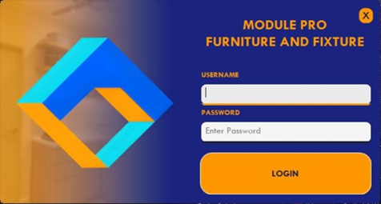
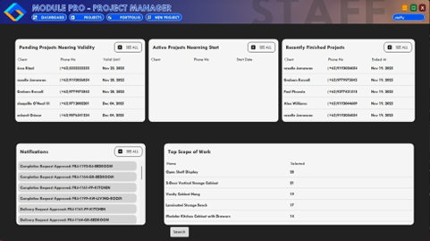
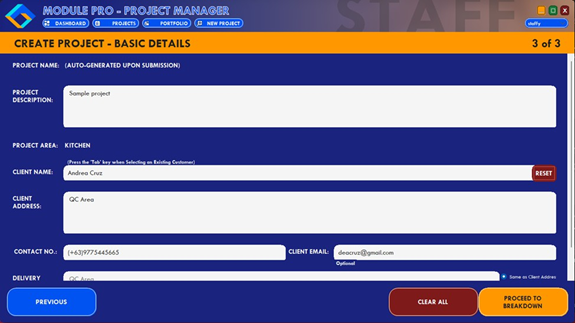
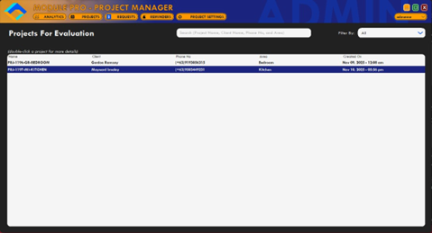
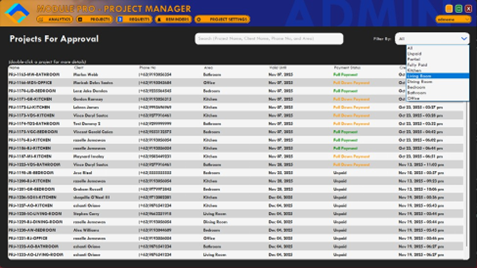
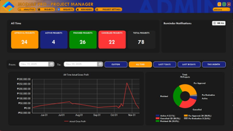
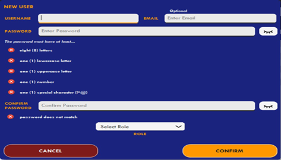

# 🏗️ Project Management Information System (PMIS)

> A desktop-based Project Management Information System developed for **Module Pro Furniture and Fixture** as a Bachelor of Science in Computer Science capstone project.

---

# 📖 Overview

The Project Management Information System (PMIS) is a desktop application designed to help Module Pro Furniture and Fixture manage projects more efficiently through a centralized system.

The application provides project tracking, approval workflows, analytics, and user management, replacing manual record-keeping and improving project monitoring.

---

# ✨ Features

- User Authentication
- Dashboard
- Project Creation
- Project Evaluation
- Project Approval
- Analytics Dashboard
- User Management
- Project Monitoring

---

# 🛠️ Technologies Used

- C#
- Windows Forms
- SQLite
- Visual Studio

---

# 📸 System Preview

## Login

---

## Dashboard

---

## Project Creation

---

## Project Evaluation

---

## Project Approval

---

## Analytics Dashboard

---

## User Creation

---

# 📄 Documentation

The complete capstone documentation is included in this repository.

---

# 🚀 Future Improvements

- Email Notifications
- Cloud Database
- Mobile Application
- Data Visualization Improvements
- Project Forecasting

---

# 👨‍💻 Contributors

- Newton Ilagan
- Capstone Team Members

---

# ⭐ Acknowledgements

Special thanks to our thesis adviser, panelists, classmates, and our client, Module Pro Furniture and Fixture, for their guidance throughout the development of this project.
